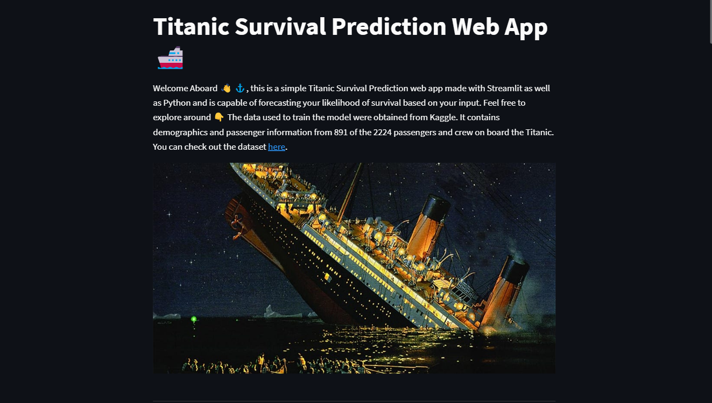
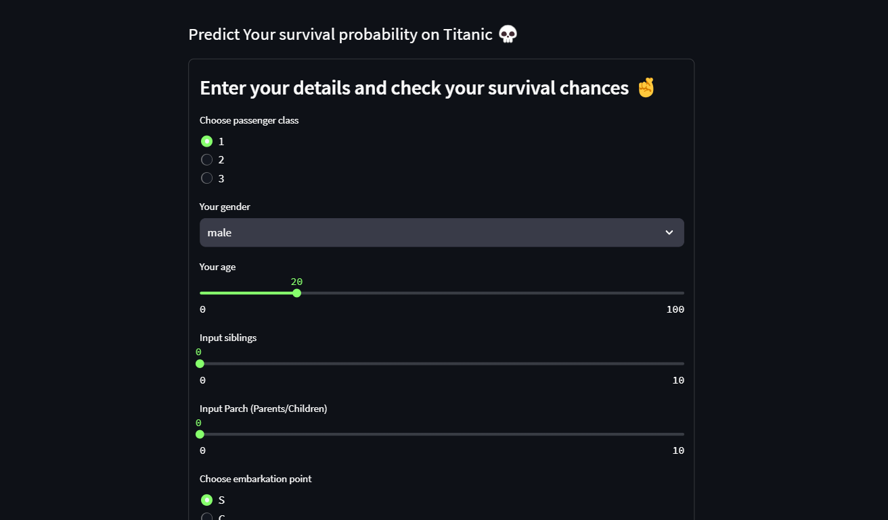

# __Titanic Survival Prediction Web App__

 Welcome Aboard ⚓ This is a simple Titanic Survival Prediction web app made with Streamlit as well as Python and is capable of forecasting your likelihood of survival based on your input. The model is trained using Random Forest Classifier and the dataset used to train the model is taken from [Kaggle](https://www.kaggle.com/c/titanic/data).

## Website link

## __Screenshots__

 

 